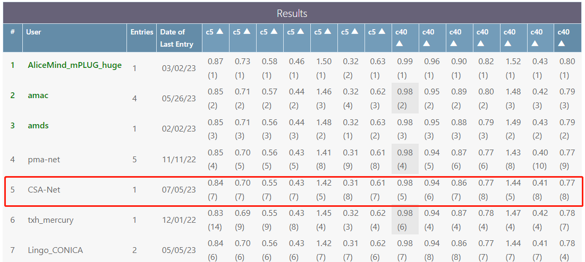
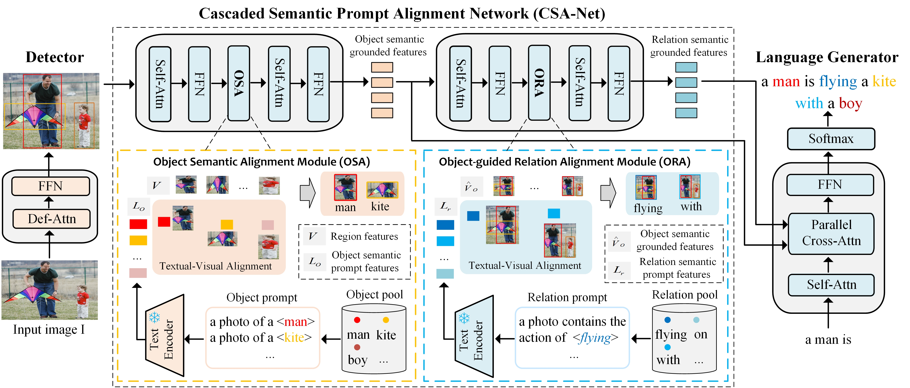

## Cascade Semantic Prompt Alignment for Image Captioning


## Results

### COCO dataset onlie test 
MSCOCO Leaderboard (TeamName:CSA-Net)

<div align=center>  

</div>

### nocaps dataset zero-shot test 
[http://evalai.s3.amazonaws.com/media/submission_files/submission_294466/b4a71cc2-e9d6-4970-9897-381648e797e6.json
](http://evalai.s3.amazonaws.com/media/submission_files/submission_294466/b4a71cc2-e9d6-4970-9897-381648e797e6.json
) 

## Introduction


<div align=center>  

</div>


## Installation

### Requirements
* Python >= 3.9, CUDA >= 11.3
* PyTorch >= 1.12.0, torchvision >= 0.6.1
* Other packages: pycocotools, tensorboard, tqdm, h5py, nltk, einops, hydra, spacy, and timm


## Usage

> Currently, the README and source code are under its initial version. The cleaned and detailed version may be updated soon.

### Data preparation

Download and extract COCO 2014 for image captioning including train, val, and test images with annotations from
[http://cocodataset.org](http://cocodataset.org/#download).

Object and relation semantic prompts features from regionclip text encoder.
We expect the directory structure to be the following:
```
path/to/coco_caption/
├── annotations/  # annotation json files and Karapthy files
├── train2014/    # train images
├── val2014/      # val images
└── test2014/     # test images
```

* Copy the files in `data/` to the above `annotations` folder. It includes `vocab.json` and some files containing Karapthy ids.

### Training

CUDA_VISIBLE_DEVICES=1,2 python train_caption.py exp.name=caption_4ds model.detector.checkpoint=4ds_detector_path optimizer.freezing_xe_epochs=10 optimizer.freezing_sc_epochs=10 optimizer.finetune_xe_epochs=0 optimizer.finetune_sc_epochs=0 


### Evaluation

```shell
# evaluate on the test split
python eval_caption.py +split='test' exp.checkpoint=path_to_caption_checkpoint
```
